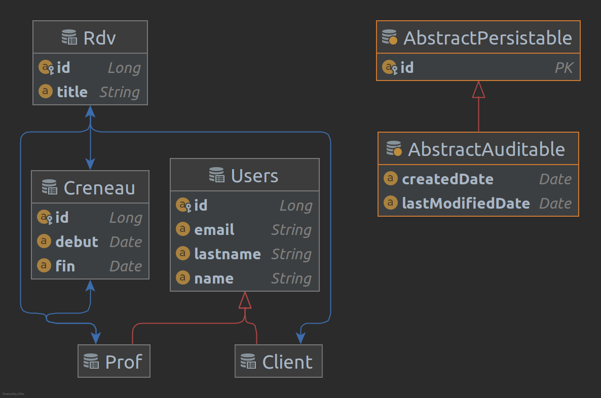

# Projet TAA 2021

*** 

### Développeurs

- Arnaud Akoto
- Karim Ougueur

***
Le but du projet `TAA2021` est de développer une api web calqué sur le modèle de `Doctolib`.
<br>
Pour mener à bien notre tâche, nous sommes passés par plusieurs étapes qui seront détaillées dans les sections suivantes

## Model métier


***

## Etape 1 : Prise en main de JPA

L'objectif dans cette première partie est de comprendre le mécanisme derrière le fonctionnement de JPA et de réaliser
une application en se plaçant dans un cadre classique de développement sans serveur d’application au départ.

C'est dans cette partie que nous acquérons notamment les notions nécessaires pour la suite de nos développements. Entre
autre :

- Le paramétrage d'un projet maven

```xml
<?xml version="1.0" encoding="UTF-8"?>
<project xmlns="http://maven.apache.org/POM/4.0.0"
         xmlns:xsi="http://www.w3.org/2001/XMLSchema-instance"
         xsi:schemaLocation="http://maven.apache.org/POM/4.0.0 http://maven.apache.org/xsd/maven-4.0.0.xsd">
    <modelVersion>4.0.0</modelVersion>
    <parent>
        <groupId>org.Springframework.boot</groupId>
        <artifactId>Spring-boot-starter-parent</artifactId>
        <version>2.4.5</version>
        <relativePath/> <!-- lookup parent from repository -->
    </parent>
    <groupId>fr.istic.taa</groupId>
    <artifactId>protolib</artifactId>
    <version>2.0.0-SNAPSHOT</version>
    ....
```

- La connexion d'une application à une base de données

```xml

<property name="hibernate.connection.driver_class" value="com.mysql.jdbc.Driver"/>
<property name="hibernate.connection.password" value="Artkoto_db"/>
<property name="hibernate.connection.url" value="jdbc:mysql://mysql.istic.univ-rennes1.fr/base_yakoto"/>
<property name="hibernate.connection.username" value="user_yakoto"/>
<property name="hibernate.dialect" value="org.hibernate.dialect.MySQL8Dialect"/>
<property name="hibernate.c3p0.min_size" value="5"/>
<property name="hibernate.c3p0.max_size" value="20"/>
<property name="hibernate.c3p0.timeout" value="300"/>
<property name="hibernate.c3p0.max_statements" value="50"/>
<property name="hibernate.c3p0.idle_test_period" value="3000"/>
```

- L'implémentation de model métier, de DAO et de services

```java

@Entity
@Inheritance(strategy = InheritanceType.SINGLE_TABLE)
@Data
public abstract class Users implements Serializable {

    @Id
    @GeneratedValue(strategy = GenerationType.IDENTITY)
    private Long id;

    @Column(unique = true)
    private String email;

    private String name;

    private String lastname;

    public Users() {
    }

}
```

Cette premiere étape du projet est entièrement
accessible [ici](https://github.com/Artkoto/tpjpa2021/releases/tag/Tp1Finished).

:rotating_light: Attention ! Pour le bon fonctionnement de cette premiere version, vous devez avoir access aux serveurs de `l'Istic` via
un `VPN` ou simplement en étant connecté à un point d'accès de l'établissement. (Vous êtes aussi libre de modifier le
fichier `persistence.xml` pour associer l'application à une autre base de données).

## Etape 2 : Implémentation de services web

Dans cette seconde partie, il est question d'implémenter des services `REST` à l'aide d'un serveur `JaxRS`.

Avant d'entrer dans le vif du sujet, il était important que nous comprenions l'interaction entre la partie front et le
serveur. D'où l'implémentation d'une `servlet` permettant d'afficher les informations qu'on lui envoie à l'aide d'un
formulaire html via une `requette http`. Le tout tournant sur un server `Jetty`

- exemple de servlet

```java
//exemple de servlet
@WebServlet(name = "userinfo",
        urlPatterns = {"/UserInfo"})
public class UserInfo extends HttpServlet {
    public void doPost(HttpServletRequest req,
                       HttpServletResponse resp)
            throws ServletException, IOException {
        resp.setContentType("text/html");
        resp.setCharacterEncoding("UTF-8");
        req.setCharacterEncoding("UTF-8");
        PrintWriter out = resp.getWriter();


        out.println("<HTML>\n<BODY>\n" +
                "<H1>Recapitulatif des informations</H1>\n" +
                "<UL>\n" +
                " <LI>Nom: "
                + req.getParameter("name") + "\n" +
                " <LI>Prenom: "
                + req.getParameter("firstname") + "\n" +
                " <LI>Age: "
                + req.getParameter("age") + "\n" +
                "</UL>\n" +
                "</BODY></HTML>");
    }
}
```

- Exemple de formulaire d'envoi de données.

```html
<!DOCTYPE html>
<html lang="en">
<head>
    <meta charset="UTF-8">
    <title>Title</title>
</head>
<body>
<form Method="POST" Action="/UserInfo">
    Name : <label>
    <input type=”text” size=”20” name='name'>
</label><br>
    Firstname : <label>
    <input type=”text” size=”20” name='firstname'>
</label><br>
    Age : <label>
    <input type=”text” size=”2” name='age'>
</label><br>
    <button type="submit" value="Send">Send</button>
</form>
</body>
</html>
```

C'est seulement après avoir compris le fonctionnement de cette interaction `Client-serveur` que nous pouvons implémenter
nos `services`
à l'aide notamment de `JaxRS`.

- exemple de serveur JaxRS

```java
public class RestServer {

    private static final Logger logger = Logger.getLogger(RestServer.class.getName());

    public static void main(String[] args) {

        UndertowJaxrsServer ut = new UndertowJaxrsServer();

        TestApplication ta = new TestApplication();

        ut.deploy(ta);

        ut.start(
                Undertow.builder()
                        .addHttpListener(8081, "localhost")

        );

        logger.info("JAX-RS based micro-service running!");
    }
}
```

- exmple de service

```java
public class RdvService {

    private RdvDao rdvDao = new RdvDao();

    public Optional<Rdv> getRdv(final Long id) {
        return rdvDao.findOne(id);
    }

    public Iterable<Rdv> getRdvs() {
        return rdvDao.findAll();
    }

    public Iterable<Rdv> getRdvByTitle(String title) {
        return rdvDao.findByTitle(title);
    }

    public void deleteRdv(final Long id) {
        if (rdvDao.existsById(id)) {
            rdvDao.deleteById(id);
        }
    }

    public Rdv saveRdv(Rdv rdv) {
        return rdvDao.save(rdv);
    }

    public Rdv modifyRdv(final Long id, Rdv rdv) {
        if (rdvDao.existsById(id)) {
            Rdv rdvTOModify = getRdv(id).get();
            rdvTOModify.setClient(rdv.getClient());
            rdvTOModify.setProf(rdv.getProf());
            rdvTOModify.setCreneau(rdv.getCreneau());
            rdvTOModify.setTitle(rdv.getTitle());
            return rdvDao.update(rdvTOModify);
        }
        return rdv;
    }
}
```

Cette seconde étape du projet est entièrement
accessible [ici](https://github.com/Artkoto/tpjpa2021/releases/tag/Tp2Finished).

:rotating_light: Attention ! Pour le bon fonctionnement de cette seconde version, vous devez avoir access aux serveurs de `l'Istic` via
un `VPN` ou simplement en étant connecté à un point d'accès de l'établissement. (Vous êtes aussi libre de modifier le
fichier `persistence.xml` pour associer l'application à une autre base de données).

## Etape 3 : Spring

### Vue d'ensemble

L'objectif dans cette dernière partie du projet est d'optimiser notre travail à l'aide de `Spring`. Pour rappel, Spring
est projet `open source` Java facilitant le développement et la réalisation de tests à l'aide de ses nombreux
frameworks.

Dans notre projet, nous les frameworks de Spring suivant :

- Spring Framework
- Spring Boot
- Spring Data
- Spring Aspect

_La liste complete des frameworks de Spring est disponible sur le lien
suivant : [Spring.io/projects](https://Spring.io/projects)._

Cette étape du projet comporte trois grandes parties :

- <b> Partie 1 : L'implémentation de l'injection de dépendances de Spring </b>
- <b> Partie 2 : L'implémentation de la programmation orienté aspect avec Spring AOP </b>
- <b> Partie 3 :  La migration de l'application en application Spring </b>

Les deux premiere parties sont disponibles sur le depot
suivant [KarimOugueur/TAA-TP3-partie-1-2](https://github.com/KarimOugueur/TAA-TP3-partie-1-2).

### Détail du développement de la partie 3

Cette étape consiste à faire un refactoring complet de l'application afin d'en faire, une application Spring.

Pour ce faire, il a fallu naturellement reconfigurer le projet maven en ajoutant notamment les dependencies liées à
Spring. Dans ce processus, les classes métiers ne sont pas grandement impactées et conservent leur forme dans l'ensemble
contrairement aux classes DAO et Controller REST qui subissent d'énormes modifications avec l'utilisation
de `Spring boot et Sprig data`.

Grâce à `Spring AOP`, il nous est possible de `logger` tous les accès à nos services REST.

- exemple de controller REST avec Spring boot

```java

@CrossOrigin
@RestController
@RequestMapping("/rdv")
public class RdvController {
    @Autowired
    RdvService rdvService;

    @GetMapping("/id={Id}")
    public Optional<Rdv> getRdvById(@PathVariable("Id") Long Id) {
        return rdvService.getRdv(Id);
    }
}
```

- Exemple de DAO avec Spring data

```java

@Repository
public interface UsersRepository extends JpaRepository<Users, Long> {

    @Query("SELECT e FROM Prof  as e")
    List<Users> findAllProfs();

    @Query("SELECT e FROM Client as e")
    List<Users> findAllClients();
}
```

- exemple d'aspect avec Spring AOP

```java

@Aspect
@Component
public class ServiceMonitor {
    private static final Logger log = Logger.getLogger(ServiceMonitor.class.getPackage().getName());

    @AfterReturning("execution(* fr.istic.taa.controller.*.*(..))")
    public void logServiceRestAccess(JoinPoint joinPoint) {
        log.info("Completed: " + joinPoint);
    }
}
```

### Installation et démarrage de l'application

#### Prérequis

Pour Utiliser cette application il vous faut préalablement installé sur votre machine :

- maven
- Java 8 ou plus
- docker (si vous souhaitez tester l'api avec l'application front-end associer)

***

#### 1) Téléchargement de l'application

- Télécharger
  [le front-end et la base de donnée](https://github.com/Artkoto/tpjpa2021/archive/refs/tags/BDD_et_application_Front.zip).
- Télécharger
  l'application [l'application du back-end](https://github.com/Artkoto/tpjpa2021/archive/refs/tags/AspectAdded.zip).

#### 2) Installation et Lancement de l'application

###### Pour déployer la `base de données` et projet de `front-end` vous devez suivre les étapes suivantes :

- Décompresser l'archive contenant le front-end et la base de données que vous avez téléchargé à l'étape de
  téléchargement.
- Dans un `terminal`, se placer dans le repertoire du même nom de l'archive décompressée et lancer la commande
  suivante :

```bash
cd database/; docker-compose up -d ; cd ../proftolib_docker/ ; docker-compose up -d ; cd ../
```


###### Pour Exécuter l'application `back-end` :

- Décompresser l'archive contenant le back-end que vous avez téléchargé à l'étape téléchargement.
- Dans un `terminal`, se placer dans le repertoire du même nom de l'archive décompressée et lancer la commande
  suivante :

```bash
mvn clean install ; java -jar target/protolib-2.0.0-SNAPSHOT.jar 
```
***
Si les étapes précédentes ont été respectées, vous pouvez maintenant utiliser l'application.
via le l'adresse suivante : [localhost:8081](http://localhost:8081/).

Vous avez aussi accès à `phpmyAdmin` via l'adresse suivante : [localhost:8080](http://127.0.0.1:8080/index.php?route=/database/structure&server=1&db=db_istic_tp_taa).
```properties
#identifiant de connexion phpmyAdmin
username=artkoto
password=Akoto
```
***

###### Documentation OpenAPI

La documentation openAPI de notre projet est disponible via l'url
suivante : [http://localhost:9000/swagger-ui](http://localhost:9000/swagger-ui/index.html?configUrl=/v3/api-docs/swagger-config#/)


***


###### Pour supprimer les conteneurs Docker relatifs à l'application :

- Dans un `terminal`, se placer dans le repertoire contenant le front-end et la base de données et lancer la commande et
  lancer la commande suivante :

```bash
cd database/; docker-compose down ; cd ../proftolib_docker/ ; docker-compose down ; cd ../
```
